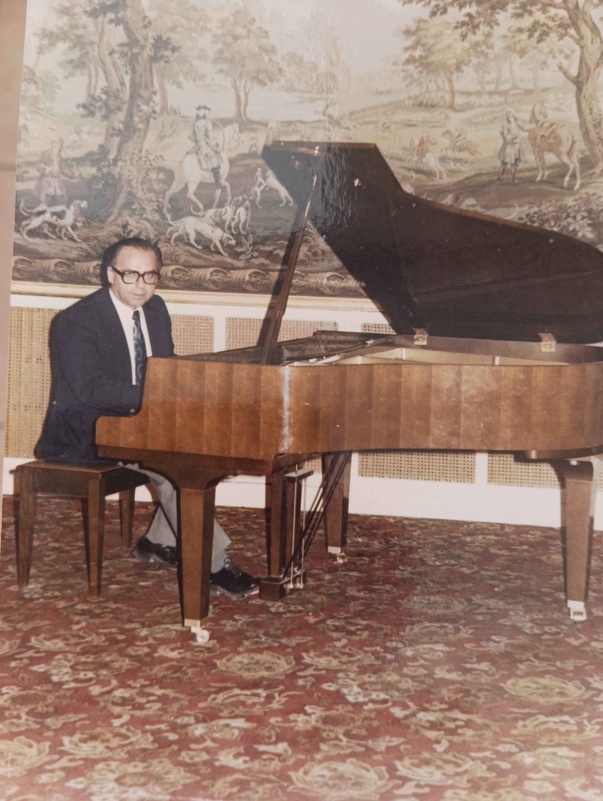
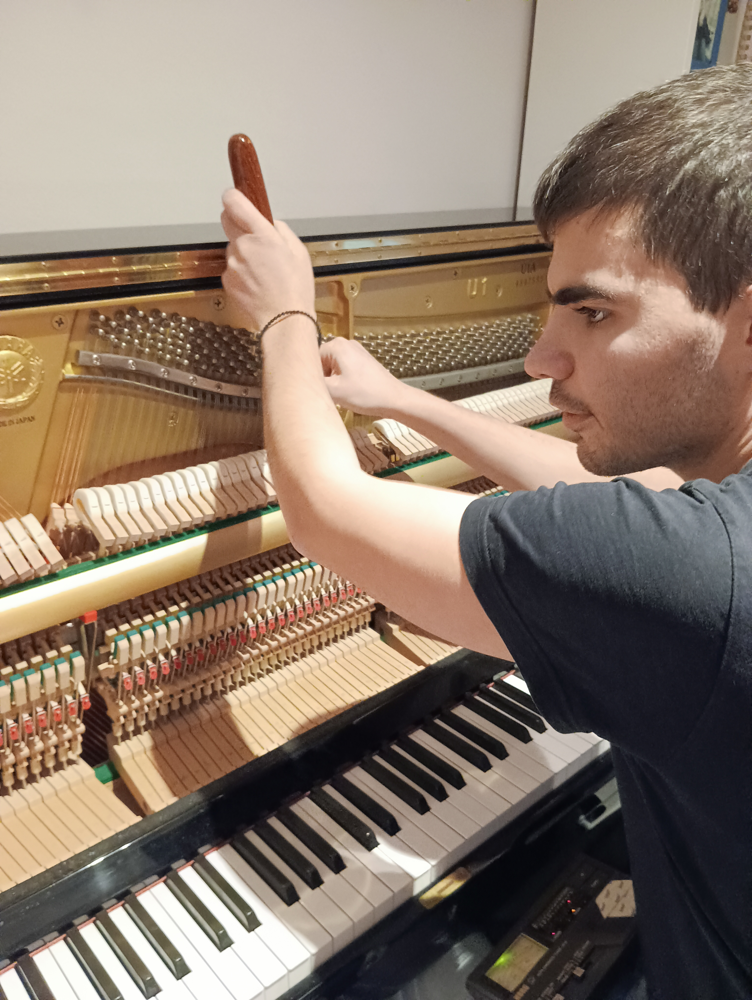
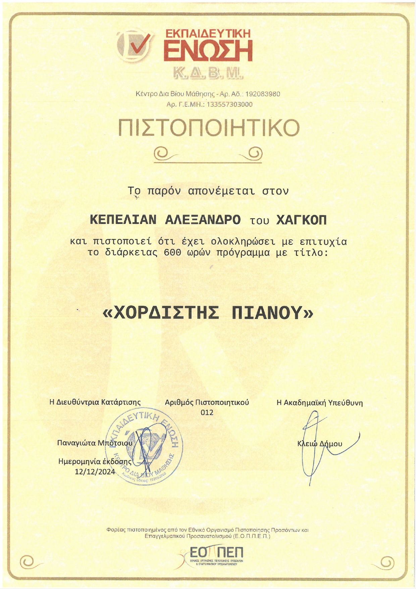
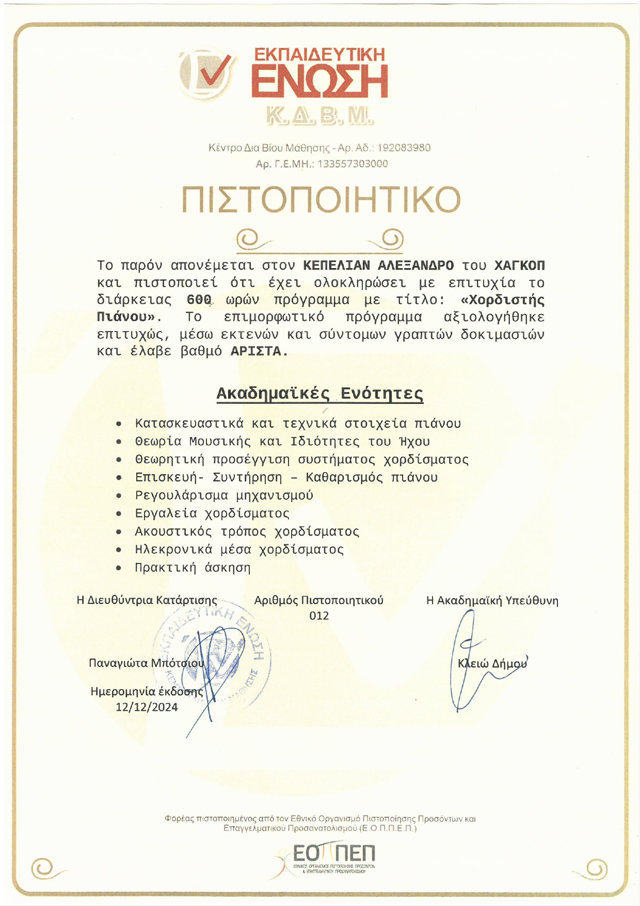

<header>
  <section id="hero">
    <blockquote cite="https://en.wikipedia.org/wiki/Arthur_Rubinstein">
      Η μουσική αποτελεί γλώσσα που υπερβαίνει τους φραγμούς και φέρνει κοντά τους ανθρώπους από όλες τις πτυχές
      της ζωής, - Άρθουρ Ρουμπινστάιν
    </blockquote>	
  </section>
  <h1>Το πιάνο σας αξίζει την καλύτερη φροντίδα</h1>
  

    Αναζητάτε έναν επαγγελματία χορδιστή για το πιάνο σας; Η σωστή συντήρηση και το τακτικό χόρδισμα 
    (τουλάχιστον μία φορά ανά έτος) είναι το κλειδί για έναν άρτιο, κρυστάλλινο ήχο.
  

</header>
<main>
  <section>
    <h2>Σχετικά με τον παππού μου</h2>
    <figure>
      <picture>
        <!-- <source srcset="" media="" type="">
             <source srcset="" media="" type=""> -->
        
      </picture>
      <figcaption>Ο παππούς μου στο πιάνο</figcaption>
    </figure>
      

        Ο παππούς μου, Μελιξέ Κουπελιάν, Αρμένιος στην καταγωγή, υπήρξε υψηλής κλάσεως πιανίστας και ακορντεονίστας στη Συρία και στο Λίβανο. Είχε ιδιαίτερη θέρμη για το πιάνο, 
        γεγονός πού τον οδήγησε να καταπιαστεί με το χόρδισμα και τη συντήρησή του. Το πέτυχε κατόπιν καθοδήγησης καταξιωμένων επαγγελματιών του χώρου, αλλά και υπέρμετρου 
        προσωπικού κόπου, μελετώντας τις αρχές του χορδίσματος και βάζοντάς τες σ' εφαρμογή, αξιοποιώντας παράλληλα την μουσικότητα και τις ακροαστικές δυνατότητες που είχε κατακτήσει
        στη διάρκεια της ζωής του. 
      

      

        Ερχόμενος στην Ελλάδα το 1981, πλάι στην Ελληνίδα σύζυγό του Ελένη, καθηγήτρια κλασσικής κιθάρας, διέπρεψε στον τομέα του χορδίσματος, της συντήρησης, της αποκατάσταστης και
        της αναπαλαίωσης κάθε τύπου πιάνου, γεγονός που αποδεικνύεται και από και τις εγκάρδιες αναφορές στ' όνομά του από παλιούς του πελάτες και συναδέλφους ακόμα και σήμερα. Παράλληλα,
        μεταλαμπάδευσε, από τρυφερή ακόμα ηλικία, τις γνώσεις και τις δεξιότητές του στα παιδιά και στα εγγόνια του, εμφυσώντας τους το πάθος πού τον διακατείχε για τη μουσική αλλά και για
        τις μηχανικές και ακουστικές ιδιότητες του οργάνου.
      

    </section>
    <section>
      <h2>Σχετικά με μένα</h2>
      <figure>
        <picture>
          <!-- <source srcset="" media="" type="">
               <source srcset="" media="" type=""> -->
          
        </picture>
        <figcaption>Κατά το χόρδισμα</figcaption>
      </figure>        
      

        Ονομάζομαι Κουπελιάν Αλέξανδρος και είμαι πιστοποιημένος χορδιστής πιάνων αλλά και πιανίστας. Ασχολούμαι με την ερμηνεία κλασσικής μουσικής, τη σύνθεση, το χόρδισμα και τη συντήρηση
        των πιάνων από την ηλικία των 8 ετών, υπό την καθοδήγηση του παππού μου. Φοίτησα στα μουσικά σχολεία Παλλήνης και Αλίμου και ύστερα ολοκλήρωσα τις σπουδές μου ως κοινωνικός λειτουργός 
        στο Πανεπιστήμιο Δυτικής Αττικής, με μεταπτυχιακό στην Ψυχοκοινωνική Συμβουλευτική. Μία εκ των ώσεων προς την ενασχόληση με τη μουσική και το χόρδισμα, πέρα από την επιρροή του παππού μου,
        αποτέλεσε η απώλεια της όρασής μου σε νεαρή ηλικία. Οι ήχοι έπαιξαν και παίζουν το ρόλο καταφυγίου για εμένα. Χόρδιζα πιάνα και συντηρούσα μηχανισμούς, τόσο στο εργαστήριο του παππού μου,
        όσο και σ' εκείνο του κύριου Νικοτιάν. Τέλος, σταθμό στην πορεία αυτή αποτέλεσε η πιστοποίησή μου στο χόρδισμα και τη συντήρηση του πιάνου (600 ωρών) από το <abbr title="Κέντρο Δια Βίου Μάθησης">Κ.Δ.Β.Μ.</abbr> Εκπαιδευτική Ένωση.
      

      <figure>
        
        
        <figcaption>Πιστοποίηση χορδίσματος από το Κ.Δ.Β.Μ Εκπαιδευτική Ένωση</figcaption>
      </figure>    
    </section>
    <section>  

      <section>
        <h2>Παρεχόμενες υπηρεσίες</h2>
        <ul>
          <li>Χόρδισμα υψηλής ακρίβειας για κάθε τύπο πιάνου.</li>
          <li>Ρύθμιση και επισκευή για βελτίωση της αίσθησης και της απόκρισης των πλήκτρων.</li>
          <li>Επαγγελματική φροντίδα για κάθε ανάγκη συντήρησης.</li>
        </ul>
      </section>
      <section>
        <h2>Γιατί να επιλέξετε εμένα;</h2>
        <ul>
          <li>Εξειδίκευση και πάθος στον χώρο του xoρδίσματος.</li>
          <li>Άμεση εξυπηρέτηση στον χώρο σας.</li>
          <li>Προσιτές τιμές και διαφάνεια.</li>
        </ul>
      </section>
    </main>
    <footer>
      
Εξυψώστε τη μουσική σας, μια συνεδρία χορδίσματος τη φορά.

    </footer>   
  </body>
</html>
